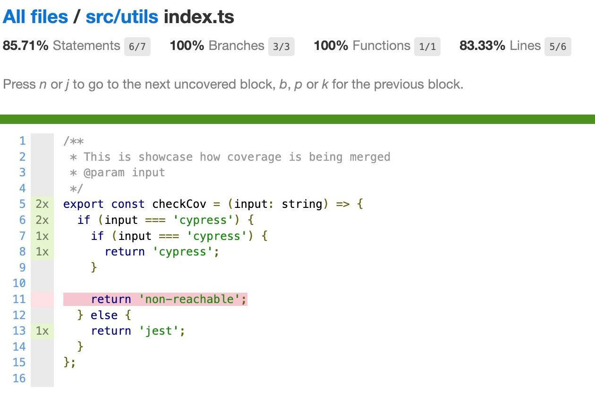
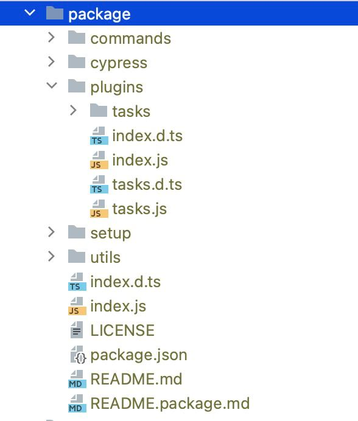

# cypress-template

Template to create cypress library with jest tests, correct package structure,
coverage connected to cypress and merging coverage for jest and cypress

- [x] typescript support
- [x] code coverage for cypress and jest, merge coverage
- [x] formatting and eslint
- [x] jest tests
- [x] proper library extraction

Create repository using this template if you need to create cypress library.

### Project structure

| Location      | description                                                                                                  |
|---------------|--------------------------------------------------------------------------------------------------------------|
| `src`         | all library code will be located here, see [folder src](#folder-src) section                                 |
| `integration` | folder contains cypress tests for testing the library, see [folder integration](#folder-integration) section |
| `tests`       | folder contains jest unit tests for testing the library                                                      |
| `reports`     | directory that will be created after tests run with coverage info and reports                                |
| `.scripts`    | helper scripts                                                                                               |
| `.github`     | github actions workflows                                                                                     |
| `.husky`      | pre-commit hooks (install by `npm run husky:install`)                                                        |

#### Folder src
Your library will contain only the code that located in this folder

| Location       | Description                                                                                                                                                                                                                                                 |
|----------------|-------------------------------------------------------------------------------------------------------------------------------------------------------------------------------------------------------------------------------------------------------------|
| `src/index.ts` | export anything you want to be imported on user side from your library by '<your library name>' that should run in browser                                                                                                                                  |
| `src/cypress`  | when you library contains additional commands put types for your commands inside `types.ts` file    When using some other libraries in yours you can import its types within `cypress.ts` **Note**: this folder should have `cypress` name for easier types setup when you library is ready (this way you will not need to add your library in tsconfig.json types section) |
| `src/plugins`  | when you library need to handle node events (register tasks or other things on node side) you can put it all here.  Export all required methods within `index.ts` file.  So when using library user imports will be `'<your library name>/plugins'` |
| `src/setup`    | all functions that should be run in browser, export within `index.ts`                                                                                                                                                                                       |
| `src/utils`    | some functions that can be run on both environments - node and DOM (browser), export within `index.ts`                                                                                                                                                      |

#### Folder integration
| Location                           | description                                                                                                                                                                                                                                                 |
|------------------------------------|-------------------------------------------------------------------------------------------------------------------------------------------------------------------------------------------------------------------------------------------------------------|
| `integration/plugins`              | use your plugins from `src` here `ts-preprocessor.ts` is requiered to gather coverage info                                                                                                                                                                |
| `integration/support`              | use your src/support, import it replacing `src` with `cy-local` to have correct code coverage                                                                                                                                                               |
| `integration/e2e`                  | tests folder, use anything from `src`, import it replacing `src` with `cy-local` to have correct code coverage                                                                                                                                              |

### Code coverage
Coverage is being gathered from cypress and from jest, after all tests finished coverages
from both test packs will be merged

To see individual coverage reports run:
- `npm run cov:jest`  html report with coverage for jest tests
- `npm run cov:cy`  html report with coverage for jest tests
- `npm run cov`  html report with combined coverage

### Extraction

Before publishing do not forget:
 - to increment package version  for your package
 - fill all fields in package.json for your package

You can test your package by running `npm run try:pack` (All changes should be committed before that)

### Scripts

| script          | description                                                                                                                                                   |
|-----------------|---------------------------------------------------------------------------------------------------------------------------------------------------------------|
| `husky:install` | install precommit hooks                                                                                                                                       |
| `lint`          | lint code                                                                                                                                                     |
| `build`         | compile typescript by [tsconfig.build.json](./tsconfig.build.json)                                                                                            |
| `test`          | run all jest tests                                                                                                                                            |
| `test:cov`      | run all jest tests with coverage                                                                                                                              |
| `cy:open`       | start cypress in interactive mode                                                                                                                             |
| `cy:open:cov`   | start cypress in interactive mode with coverage                                                                                                               |
| `cy:run`        | run cypress tests                                                                                                                                             |
| `cy:run:cov`    | run cypress tests with coverage                                                                                                                               |
| `cov:merge`     | merge jest and cypress coverage results                                                                                                                       |
| `cov:jest`      | show html report for jest coverage (http-server should be installed globally, `npm i http-server -g`)                                                         |
| `cov:cy`        | show html report for cypress coverage (http-server should be installed globally, `npm i http-server -g`)                                                      |
| `cov`           | show html report for full coverage (http-server should be installed globally, `npm i http-server -g`)                                                         |
| `cov:check`     | check coverage by thresholds specified in [nyc.config.js](./nyc.config.js)                                                                                    |
| `pre`           | run all necessary scripts  (fmt, lint, build, tests and check cov)                                                                                            |
| `extract`       | should be run after tsc and after everything is staged. Extracts everything from 'lib' to root directory. This is required for nice imports in target library |
| `extract:undo`  | Be careful, commit everything you need before. Removes files and dirs that were extracted after `extract`                                                     |
| `try:pack`      | try to pack the library - will create archieve with library files                                                                                             |
