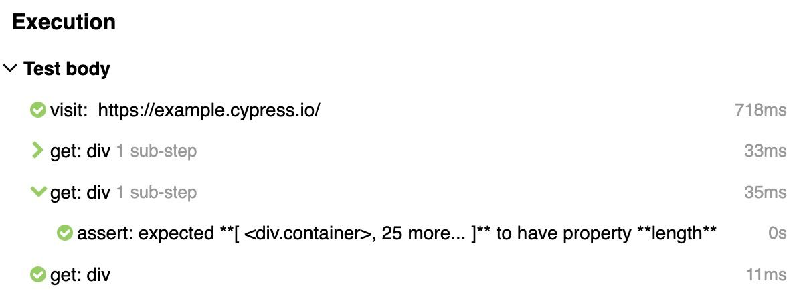
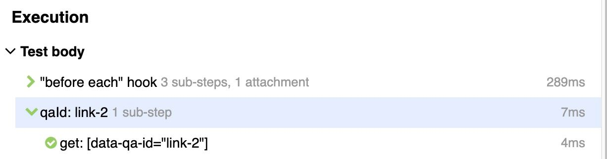
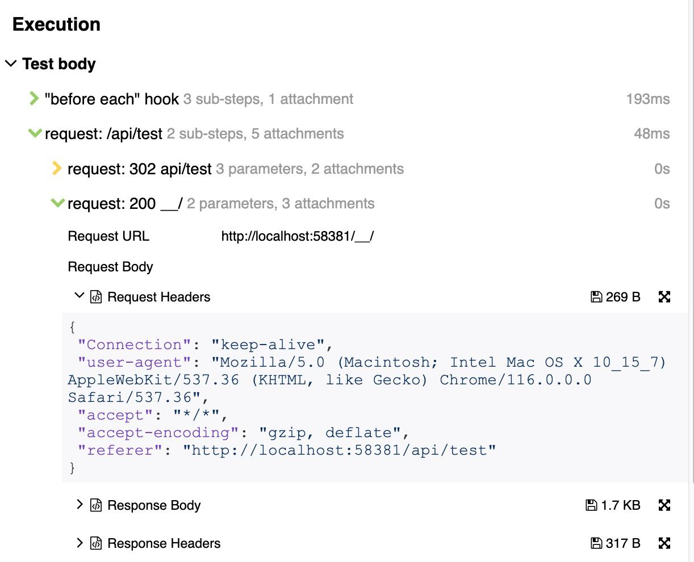
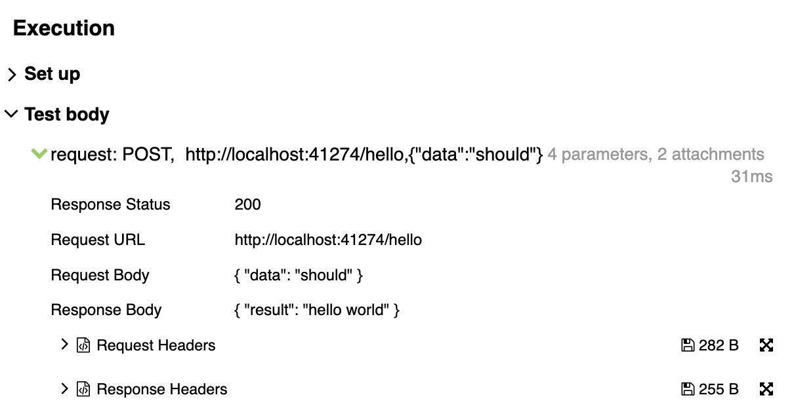
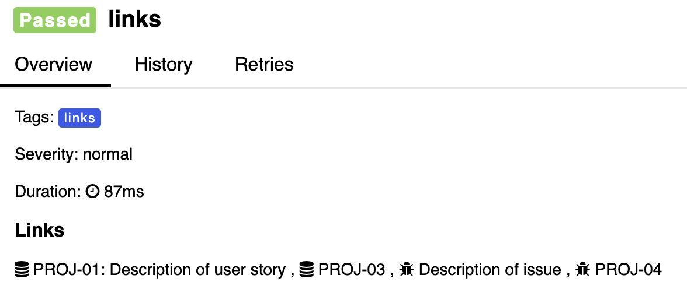

# cypress-allure-adapter

>  This is Allure plugin for Cypress providing realtime results (compatible with Allure TestOps)

 


You can watch tests execution when using with Allure TestOps. It adds tests, steps, suites and screenshots during tests execution.

In the same time you can generate [Allure Report](https://github.com/allure-framework/allure2) from these results, and it will have all necessary fields.

To achieve compatibility with Allure TestOps (watch mode) this plugin has different architecture(based on ws) in comparison with existing plugins
which allows not to depend on cypress when writing test results.

**Features**: 
 - automatically adds all cypress commands to report (this is configurable)
 - automatically adds videos / screenshots
 - automatically adds hooks (before all, before each, after each, after all) to tests
 - writes test results after each test - so you can watch execution in Allure TestOps 
 - will create tests that were not run (because of `before` or `beforEach` hooks failures) with unknown status - so total number of tests would be the same from run to run
 - has [interface](./docs/interface.md#tag) to add metadata like tags, links, owner, host and others.
 - has [interface](./docs/interface.md#startStep) to add additional steps
 - has [interface](./docs/interface.md#testStatus) to set status message for tests - `cy.allure().testDetails({ message: "This test is skipped because needs to be reviewed" })`
 - wraps custom commands into parent step, so report is cleaner
 - [gherkin support](./docs/gherkin.md)
 - adding meta information via test or suite title (ex. `@tms("ABC-123")`)
   
Example report is here - [Allure Report example](https://mmisty.github.io/cypress-allure-adapter-example/)

## Table of Contents

1. [Installation](#installation)
1. [Environment variables](#environment-variables)
2. [To see allure report](#to-see-report)
3. [Allure Interface](#allure-interface)
4. [Adding meta information](#adding-meta-information)
4. [Advanced](#advanced)
    - [after:spec event](#afterspec-event)
    - [Before run](#before-run)
    - [Start/End test events](#startend-test-events)
    - [Add environment info](#add-environment-info)
5. [Examples](#examples)
5. [Allure TestOps](#allure-testops)
5. [Troubleshooting](#troubleshooting)
6. See also:
   - [adding screenshots](docs/screenshots.md)
6. [Credits](#credits)
6. [Change log](#change-log)
6. [Support](#support)

## Installation

Install adapter by `npm i -D @mmisty/cypress-allure-adapter`

### 1. Update support

Import `@mmisty/cypress-allure-adapter/support` into your `support/index.ts` file (or `e2e.ts`/ `e2e.js` file)

```typescript
   // e2e.ts

   // import cypress-allure-adapter first to have all custom
   // commands collapsed in report as parent command
   import '@mmisty/cypress-allure-adapter/support';
   // import other custom commands here
   ```

If you want all custom commands to be wrapped in report import adapter before adding(importing) any custom commands

<details><summary>Alternative way</summary>

Add `allureAdapterSetup(); ` in your `support/index.ts` file (or `e2e.ts` file)
   ```typescript
   import { allureAdapterSetup } from '@mmisty/cypress-allure-adapter';

allureAdapterSetup();
   ```
If you want all custom commands to be correctly wrapped in report register adapter before adding custom commands: 

 ```typescript
   import { allureAdapterSetup } from '@mmisty/cypress-allure-adapter';
   
   allureAdapterSetup();
   // register custom commands here
   ```
</details>


<details><summary>Javascript configuration</summary>

```javascript
// e2e.js

// import cypress-allure-adapter first to have all custom
// commands being collapsed in report as parent command
    import '@mmisty/cypress-allure-adapter/support';
   // import other custom commands here
```
</details>

### 2. Update plugins (setupNodeEvents)
Add `configureAllureAdapterPlugins(on, config);` into your plugins file:

```typescript
// cypress.config.ts
import { configureAllureAdapterPlugins } from '@mmisty/cypress-allure-adapter/plugins';

export default defineConfig({
  e2e: {
    setupNodeEvents(on, config) {
      configureAllureAdapterPlugins(on, config);
      
      return config;
    },
    // ...
  }
});
```
<details><summary>Javascript configuration</summary>

```javascript
// cypress.config.js
const { configureAllureAdapterPlugins } = require("@mmisty/cypress-allure-adapter/plugins");

export default defineConfig({
  e2e: {
    setupNodeEvents(on, config) {
      configureAllureAdapterPlugins(on, config);
      
      return config;
    },
    // ...
  }
});
```
</details>

### 3. Update environment variables
In `cypress.config.ts` or `cypress.config.js` or in your environment files set `allure` env var to `true`.

See other [environment variables](#environment-variables)

### 4. Types
[Typescript]: No need to setup types - should be done automatically

That's it! :tada:

## Environment variables

| Variable                                                                                                                                                                                                                            | Description                                                                                                                                                                                                                                                                                                                                                                                                                                                                                                   |
|-------------------------------------------------------------------------------------------------------------------------------------------------------------------------------------------------------------------------------------|---------------------------------------------------------------------------------------------------------------------------------------------------------------------------------------------------------------------------------------------------------------------------------------------------------------------------------------------------------------------------------------------------------------------------------------------------------------------------------------------------------------|
| **allure**<br/>_type: boolean_<br/>_default: false_                                                                                                                                                                                 | Enables reporting                                                                                                                                                                                                                                                                                                                                                                                                                                                                                             |
| **allureResults**<br/>_type: string_<br/>_default: `allure-results`_                                                                                                                                                                | Path to allure results folder (where json files will be written)                                                                                                                                                                                                                                                                                                                                                                                                                                              |
| **allureResultsWatchPath**<br/>_type: string_<br/>_default: `allure-results`_                                                                                                                                                       | This is needed when using Allure TestOps: <br/>path to folder where results will be moved after finishing. <br/>This path is what you need to watch when using Allure TestOps, but default this is not specified. When you use this path test results will start to appear in Allure TestOps, video will appear only after spec is finished. <br/>If do not use this with Allure TestOps some videos may not be uploaded - videos will be uploaded only for 1 test from spec file.                            |
| **allureLogCyCommands**<br/>_type: boolean_<br/>_default: true_                                                                                                                                                                     | log cypress commands, by default will log all<br/>                                                                                                                                                                                                                                                                                                                                                                                                                            |
| **allureSkipCommands**<br/>_type: string_<br/><br/>ex.: `screenshot,wait`                                                                                                                                                           | Cypress commands separated with comma. Will skip only cypress commands used by `cy.` (any child commands will persist)<br/>Will not log specified commands as steps in allure report, by default logs all commands. You can also use asterisk in command name - it will be assumed as any chars<br/>                                                                                                                                                                                                          |
| **allureSkipSteps**<br/>_type: string_<br/><br/>ex.: `screenshot,wait` <br/>ex.: `"after each" hook*,"before each" hook*,"before all" hook*`                                                                                        | Any allure steps that were created separated with comma (ex. `cy.allure().startStep('my-step')` - `my-step` can be added into `allureSkipSteps` env var, if you put into `allureSkipCommands` this command will still persist). <br/>Will not log specified steps at all including child steps, by default logs all steps. </br>To skip before each / before all / after each or after all hooks their names can be added here. You can also use asterisk in step name - it will be assumed as any chars<br/> |
| **allureWrapCustomCommands**<br/>_type: true/false/string_<br/>_default: true_ <br/><br/>ex:<br/> -  `allureWrapCustomCommands: 'true'`<br/> - `allureWrapCustomCommands:'qaId,login'`<br/> - `allureWrapCustomCommands:'!qaValue'` | will wrap custom commands, so custom command will have child steps in report<br/>When value has string with commands split by comma will wrap only these commands. <br/>To exclude commands specify them starting with `!` - all commands specified in this variable should have either `!` or not have it <br/><br/>For this to work you should register allure plugin in setup files before any new commands are added.<br/><br/>                                           |
| **allureCleanResults**<br/>_type: boolean_<br/>_default: false_                                                                                                                                                                     | Will remove allure results on cypress start (it will be done once, after plugins are loaded)                                                                                                                                                                                                                                                                                                                                                                                                                  |
| **allureAttachRequests**<br/>_type: boolean_<br/>_default: false_                                                                                                                                                                   | Attach request/response body and status as files to request step<br/><br/>Several requests:<br/><br/>One request: <br/>                                                                                                                                                                                                                                                                                                                         |
| **allureCompactAttachments**<br/>*type: boolea*n<br/>_default: true_                                                                                                                                                                | Stringify requests attachments with spaces or not                                                                                                                                                                                                                                                                                                                                                                                                                                                             |
| **allureAddVideoOnPass**<br/>_type: boolean_<br/>_default: false_                                                                                                                                                                   | When true - will attach video for all tests (including passed), otherwise will attach videos only for failed, broken, unknown                                                                                                                                                                                                                                                                                                                                                                                 |
| **tmsPrefix** <br/>_type: string_<br/><br/>ex: `http://jira.com` or `http://jira.com/PROJECT-1/*/browse`                                                                                                                            | You can specify prefix to tms using this. It will be concatenated with value when using cypress interface like `cy.allure().tms('PROJ-01')`.  <br/>Also link can be specified with `*` - it will be replaced with id. <br/><br/>Difference between tms and issue - will have different icons: <br/><br/>                                                                                                                                                                            |
| **issuePrefix** <br/>_type: string_<br/><br/>ex: `http://jira.com` or `http://jira.com/PROJECT-1/*/browse`                                                                                                                          | The same as tmsPrefix - for issue `cy.allure().issue('PROJ-02')`                                                                                                                                                                                                                                                                                                                                                                                                                                              |
| **allureShowDuplicateWarn**<br/>_type: boolean_<br/>_default: false_                                                                                                                                                                | Show console warnings about test duplicates.                                                                                                                                                                                                                                                                                                                                                                                                                                                                  |
| **allureShowTagsInTitle**<br/>_type: boolean_<br/>_default: undefined_                                                                                                                                                              | Whether to show tags in test title or not. When undefined will keep title as is ([how to add tags?](#adding-meta-information))                                                                                                                                                                                                                                                                                                                                                                                                        |
| **allureAddNonSpecialTags**<br/>_type: boolean_<br/>_default: true_                                                                                                                                                                 | Whether to add non-special tags to tests. ([what are special tags?](#adding-meta-information))                                                                                                                                                                                                                                                                                                                                                                                                                |


### tmsPrefix and issuePrefix
`tmsPrefix` and  `issuePrefix`  - you can specify prefix to tms using this.
  Also link can be specified with `*` - it will be replced with id.
  ```javascript
     // cypress.config.ts 
     env: {
       tmsPrefix: 'http://jira.com' 
       issuePrefix: 'http://jira.com/PROJECT-1/*/browse' 
     }  
 ```
 ```javascript
     // test.spec.ts
    it('test', () => {
      cy.allure().tms('ABC-1'); // http://jira.com/ABC-1
      cy.allure().issue('ABC-2'); // http://jira.com/PROJECT-1/ABC-2/browse
      // ...
    })
  ```
  
or you can put them as [special tags](#adding-meta-information) in test title
```javascript
    it('test @tms("ABC-1") @issue("ABC-2")', () => {
      // ...
    })
  ```

### To see report
In order to see Allure Report you need to install the [CLI](https://github.com/allure-framework/allure2#download).

For nodejs you can use [allure-commandline](https://www.npmjs.com/package/allure-commandline):

`npm i -D allure-commandline`

After installed `allure` command will be available.
To see a report in browser, run in console

```
allure serve
```

If you want to generate html version, run in console

```
allure generate
```

Report example: [Allure Report](https://mmisty.github.io/cypress-allure-adapter-example)

## Allure Interface
There is allure interface available to use from tests - `cy.allure()` and `Cypress.Allure`.

For details see [interface](./docs/interface.md)

## Adding meta information
To add meta information to your tests you can either use [allure interface](#allure-interface) or special tags.

Special tags does the same as allure interface with difference that you specify them through test or suite title:

```javascript
    it('should login @feature("auth") @issue("ABC-2")', ()=> {
      // ...
    })
```

## Advanced

#### after:spec event
This plugin uses `after:spec` plugins event to write videos and to write test results for Allure TestOps.

If you also use it in your cypress project cypress-allure-adapter 
`after:spec` would be rewritten. 

To avoid that you can add `await reporter.afterSpec({ results });` into your Cypress plugin action `after:spec`:

```javascript
// cypress.config.ts
import { configureAllureAdapterPlugins } from '@mmisty/cypress-allure-adapter/plugins';

export default defineConfig({
  e2e: {
    setupNodeEvents(on, config) {
      const reporter = configureAllureAdapterPlugins(on, config);
      
      on('after:spec', async (spec, results) => {
        // your code in after spec
        await reporter.afterSpec({ results });
      })
      
      return config;
    },
    // ...
  }
});

```
#### Before run

Some operations like writing environment information, execution info or categories definitions
should be done once for a run.

To do that you need to modify your setupNodeEvents function:
 ```javascript
   // cypress.config.ts
   import { configureAllureAdapterPlugins } from '@mmisty/cypress-allure-adapter/plugins';
   
   export default defineConfig({
     e2e: {
       setupNodeEvents(on, config) {
          const reporter = configureAllureAdapterPlugins(on, config);
          
          // after that you can use allure to make operations on cypress start,
          // or on before run start
          on('before:run', details => {
             reporter?.writeEnvironmentInfo({
                info: {
                   os: details.system.osName,
                   osVersion: details.system.osVersion,
                },
             });
          });
          
         return config;
       },
       // ...
     }
   });
   ```


#### Start/End test events
If you need to add labels, tags or other meta info for tests you can use the following 
additional events for `Cypress.Allure` interface:
- `test:started` is fired after tests started but before all "before each" hooks
- `test:ended` is fired after all "after each" hooks

```javascript
Cypress.Allure.on('test:started', test => {
    Cypress.Allure.label('tag', 'started');
  });
```

And also if you need to do something with test before it ends:
```javascript
Cypress.Allure.on('test:ended', test => {
    Cypress.Allure.label('tag', 'ended');
    Cypress.Allure.step('before end step');
  });

```
You can put this into your `support/index.ts` file.

#### Add environment info
To add environment information into Allure Report Environment section you need to update cypress config - setup node events:

 ```javascript
   // cypress.config.ts
   import { configureAllureAdapterPlugins } from '@mmisty/cypress-allure-adapter/plugins';
   
   export default defineConfig({
     e2e: {
       setupNodeEvents(on, config) {
          const reporter = configureAllureAdapterPlugins(on, config);
          
          on('before:run', details => {
             reporter?.writeEnvironmentInfo({
                info: {
                   os: details.system.osName,
                   osVersion: details.system.osVersion,
                  // here you can add other valuable for your purpose env variables
                },
             });
          });
          
         return config;
       },
       // ...
     }
   });
   ```
Please note: if your project or other cypress plugins you've added use `before:run` event - it may be overridden unless you are using 
cypress events forwarder.

## Examples
- Here is Javascript example of using the plugin - [cypress-allure-adapter-example](https://github.com/mmisty/cypress-allure-adapter-example)
- [Allure Report example](https://mmisty.github.io/cypress-allure-adapter-example/)


## Allure TestOps

### Suites tree
To have correct suites tree you need to set up Allure TestOps:
1. Go to `Administration` section (for the whole application) -> `Custom Fields` section
2. Create 3 new fields if they not exist already: `Parent Suite`, `Suite`, `Sub Suite`
3. Go to `Settings` section for the project -> `Custom Fields`
4. Add mapping to newly added fields:
    - type key `parentSuite` and select from dropdown custom field `Parent Suite`
    - type key `suite` and select from dropdown custom field `Suite`
    - type key `subSuite` and select from dropdown custom field `Sub Suite`
5. Open `Trees` section from project settings
6. Add or modify `Suites` tree with the following chain: `Parent Suite` ->  `Suite` -> `Sub Suite`

## Troubleshooting
To see debug log run cypress with DEBUG env variable like: `DEBUG=cypress-allure* npm run cy:open`

### No allure-results folder
- make sure you have enabled plugin by `allure` env variable
- to be continued

### No results in allure folder
 - make sure you are not overriding config in plugins (env variables, and events)
 - make sure you return config object within setupNodeEvents

## Credits
Thanks to [@shelex](https://github.com/shelex), without his plugin this plugin would have been harder to start. 

## Change log

[see change log](./CHANGELOG.md)

## Support

Mostly, I develop this plugin during 
my free time. However, I need your 
support to take it to the next level. 
Your donation will directly contribute 
to the further development of this
 plugin, allowing me to dedicate more 
time and resources to enhancing its 
features, improving user experience, 
and ensuring its compatibility with the 
latest versions. Help this plugin to grow 
by [donating - paypal](https://www.paypal.me/tpitko).
