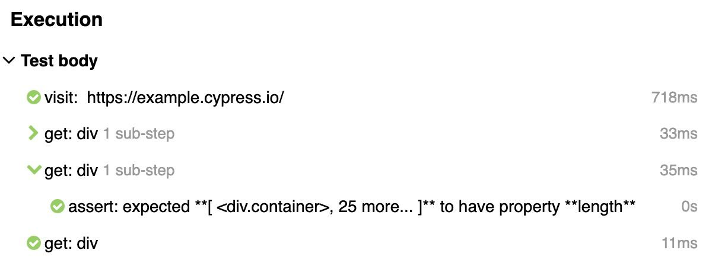
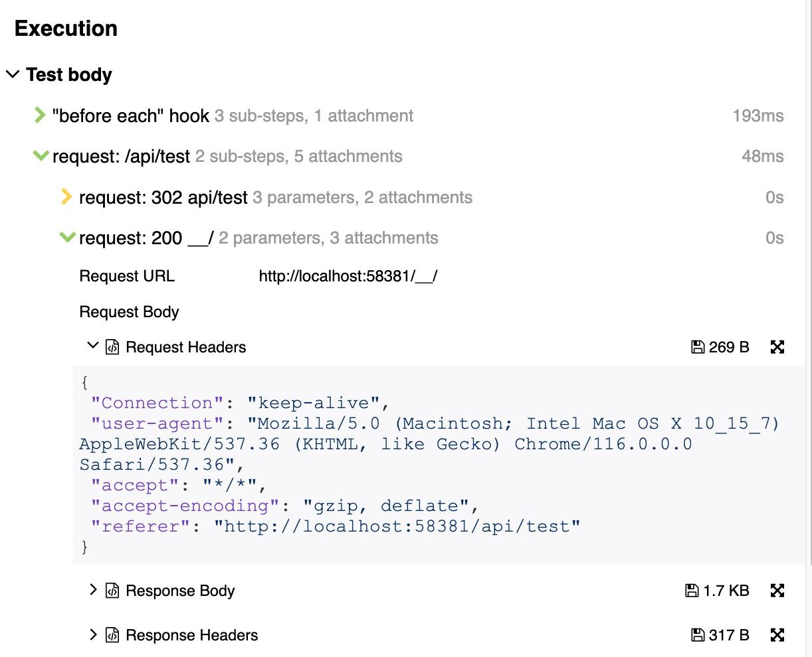

# cypress-allure-adapter

This is allure adapter for Cypress providing realtime results. 
It is useful when using Allure TestOps - so you can watch tests execution. It adds tests, steps, suites and screenshots during tests execution.

In the same time you can generate [Allure Report](https://github.com/allure-framework/allure2) from these results and it will have all necessary fields.


Some settings were taken from [@shelex/cypress-allure-plugin](https://www.npmjs.com/package/@shelex/cypress-allure-plugin)

## Table of Contents

1. [Installation](#installation)
1. [Environment variables](#environment-variables)
2. [To see allure report](#to-see-report)
3. [Allure Interface](#allure-interface)
4. [Advanced](#advanced)
    - [after:spec event](#afterspec-event)
    - [Before run](#before-run)
    - [Start/End test events](#startend-test-events)
5. [Troubleshooting](#troubleshooting)
6. [Change log](#change-log)

## Installation

Install adapter by `npm i -D @mmisty/cypress-allure-adapter`

**Setup**: 

### 1. Update support

Add `allureAdapterSetup(); ` in your `support/index.ts` file (or `e2e.ts` file)
   ```javascript
   import { allureAdapterSetup } from '@mmisty/cypress-allure-adapter';
   
   allureAdapterSetup();
   ```
If you want all custom commands to be correctly wrapped in report register adapter before adding custom commands: 

 ```javascript
   import { allureAdapterSetup } from '@mmisty/cypress-allure-adapter';
   
   allureAdapterSetup();
   // register custom commands here
   ```

### 2. Update plugins (setupNodeEvents)
Add `configureAllureAdapterPlugins(on, config);` into your plugins file:

```javascript
// cypress.config.ts
import { configureAllureAdapterPlugins } from '@mmisty/cypress-allure-adapter/plugins';

export default defineConfig({
  e2e: {
    setupNodeEvents(on, config) {
      configureAllureAdapterPlugins(on, config);
      
      return config;
    },
    // ...
  }
});
```

### 3. Update environment variables
In `cypress.config.ts` or in your environment files set `allure` env var to `true`.

See other [environment variables](#environment-variables)

### 4. Types
No need to setup types - should be done automatically

That's it! :tada:

## Environment variables

| Variable                                                                                                                                                                                                                             | Description                                                                                                                                                                                                                                                                                                                                                                                                                                                                            |
|--------------------------------------------------------------------------------------------------------------------------------------------------------------------------------------------------------------------------------------|----------------------------------------------------------------------------------------------------------------------------------------------------------------------------------------------------------------------------------------------------------------------------------------------------------------------------------------------------------------------------------------------------------------------------------------------------------------------------------------|
| **allure**<br/>_type: boolean_<br/>_default: false_                                                                                                                                                                                  | Enables reporting                                                                                                                                                                                                                                                                                                                                                                                                                                                                      |
| **allureResults**<br/>_type: string_<br/>_default: `allure-results`_                                                                                                                                                                 | Path to allure results folder (where json files will be written)                                                                                                                                                                                                                                                                                                                                                                                                                       |
| **allureResultsWatchPath**<br/>_type: string_<br/>_default: `allure-results`_                                                                                                                                                        | This is needed when using Allure TestOps: <br/>path to folder where results will be moved after all tests from spec are executed. <br/>This path is what you need to watch when using Allure TestOps, but default this is not specified. When you use this path test results will start to appear in Allure TestOps only after spec is finished. <br/>If do not use this with Allure TestOps some videos may not be uploaded - videos will be uploaded only for 1 test from spec file. |
| **allureLogCyCommands**<br/>_type: boolean_<br/>_default: true_                                                                                                                                                                      | log cypress commands, by default will log all<br/>                                                                                                                                                                                                                                                                                                                                                                                                     |
| **allureSkipCommands**<br/>_type: string_<br/><br/>ex.: `screenshot,wait`                                                                                                                                                            | Commands separated with comma<br/>Will not log specified commands as steps in allure report, by default logs all commands                                                                                                                                                                                                                                                                                                                                                              |
| **allureWrapCustomCommands**<br/>_type: true/false/string_<br/>_default: true_ <br/><br/>ex:<br/> -  `allureWrapCustomCommands: 'true'`<br/> - `allureWrapCustomCommands:'qaId,login'`<br/> - `allureWrapCustomCommands:'!qaValue'`  | will wrap custom commands, so custom command will have child steps in report<br/>When value has string with commands split by comma will wrap only these commands. <br/>To exclude commands specify them starting with `!` - all commands specified in this variable should have either `!` or not have it <br/><br/>For this to work you should register allure plugin in setup files before any new commands are added.<br/><br/>                    |
| **allureCleanResults**<br/>_type: boolean_<br/>_default: false_                                                                                                                                                                      | Will remove allure results on cypress start (it will be done once, after plugins are loaded)                                                                                                                                                                                                                                                                                                                                                                                           |
| **allureAttachRequests**<br/>_type: boolean_<br/>_default: false_                                                                                                                                                                    | Attach request/response body and status as files to request step<br/><br/>Several requests:<br/><br/>One request: <br/>                                                                                                                                                                                                                                                                                                  |
| **allureCompactAttachments**<br/>*type: boolea*n<br/>_default: true_                                                                                                                                                                 | Stringify requests attachments with spaces or not                                                                                                                                                                                                                                                                                                                                                                                                                                      |
| **allureAddVideoOnPass**<br/>_type: boolean_<br/>_default: false_                                                                                                                                                                    | When true - will attach video for all tests (including passed), otherwise will attach videos only for failed, broken, unknown                                                                                                                                                                                                                                                                                                                                                          |
| **tmsPrefix** <br/>_type: string_<br/><br/>ex: `http://jira.com` or `http://jira.com/PROJECT-1/*/browse`                                                                                                                             | You can specify prefix to tms using this. It will be concatenated with value when using cypress interface like `cy.allure().tms('PROJ-01')`.  <br/>Also link can be specified with `*` - it will be replaced with id. <br/><br/>Difference between tms and issue - will have different icons: <br/><br/>                                                                                                                                                              |
| **issuePrefix** <br/>_type: string_<br/><br/>ex: `http://jira.com` or `http://jira.com/PROJECT-1/*/browse`                                                                                                                           | The same as tmsPrefix - for issue `cy.allure().issue('PROJ-02')`                                                                                                                                                                                                                                                                                                                                                                                                                       |
| **allureShowDuplicateWarn**<br/>_type: boolean_<br/>_default: false_                                                                                                                                                                 | Show console warnings about test duplicates.                                                                                                                                                                                                                                                                                                                                                                                                                                           |


### tmsPrefix and issuePrefix
`tmsPrefix` and  `issuePrefix`  - you can specify prefix to tms using this.
  Also link can be specified with `*` - it will be replced with id.
  ```javascript
     // cypress.config.ts 
     env: {
       tmsPrefix: 'http://jira.com' 
       issuePrefix: 'http://jira.com/PROJECT-1/*/browse' 
     }  
 ```
 ```javascript
     // test.spec.ts
     cy.allure().tms('ABC-1'); // http://jira.com/ABC-1
     cy.allure().issue('ABC-2'); // http://jira.com/PROJECT-1/ABC-2/browse
  ```
  

### To see report
In order to see Allure Report you need to install the [CLI](https://github.com/allure-framework/allure2#download).

For nodejs you can use [allure-commandline](https://www.npmjs.com/package/allure-commandline):

`npm i -D allure-commandline`

After installed `allure` command will be available.
To see a report in browser, run in console

```
allure serve
```

If you want to generate html version, run in console

```
allure generate
```

## Allure Interface
There is allure interface available to use from tests - `cy.allure()` and `Cypress.Allure`.

For details see [interface](./docs/interface.md)

## Advanced

#### after:spec event
If you use Cypress action `after:spec` in plugins you
can use the following configuration to have video attached to tests:

```javascript
// cypress.config.ts
import { configureAllureAdapterPlugins } from '@mmisty/cypress-allure-adapter/plugins';

export default defineConfig({
  e2e: {
    setupNodeEvents(on, config) {
      const reporter = configureAllureAdapterPlugins(on, config);
      
      on('after:spec', async (spec, results) => {
        // your code in after spec
        await reporter.afterSpec({ results });
      })
      
      return config;
    },
    // ...
  }
});

```
#### Before run

Some operations like writing environment information, execution info or categories definitions
should be done once for a run.

To do that you need to modify your setupNodeEvents function:
 ```javascript
   // cypress.config.ts
   import { configureAllureAdapterPlugins } from '@mmisty/cypress-allure-adapter/plugins';
   
   export default defineConfig({
     e2e: {
       setupNodeEvents(on, config) {
          const reporter = configureAllureAdapterPlugins(on, config);
          
          // after that you can use allure to make operations on cypress start,
          // or on before run start
          on('before:run', details => {
             reporter?.writeEnvironmentInfo({
                info: {
                   os: details.system.osName,
                   osVersion: details.system.osVersion,
                },
             });
          });
          
         return config;
       },
       // ...
     }
   });
   ```


#### Start/End test events
If you need to add labels, tags or other meta info for tests you can use the following additional events for Cypress.Allure interface:
- `test:started` is fired after tests started but before all "before each" hooks
- `test:ended` is fired after all "after each" hooks

```javascript
Cypress.Allure.on('test:started', test => {
    Cypress.Allure.label('tag', 'started');
  });
```

And also if you need to do something with test before it ends:
```javascript
Cypress.Allure.on('test:ended', test => {
    Cypress.Allure.label('tag', 'ended');
    Cypress.Allure.step('before end step');
  });

```
You can put this into your `support/index.ts` file.

## Troubleshooting

To see debug log run cypress with DEBUG env variable like: `DEBUG=cypress-allure* npm run cy:open`

## Change log
### 0.8.4
 - environment variable to switch on and off cypress commands logging (`allureLogCyCommands: 'true'`)
 - environment variable to wrap specific commands (allureWrapCustomCommands)
   - commands can be excluded by `allureWrapCustomCommands: '!qaId,!cust',` - all should have `!` before command name
   - or can be included `allureWrapCustomCommands: 'qaId'`
 - requests improvements

### 0.8.2
 - fix for wrapping custom commands that doesn't return anything but have subject

### 0.8.1 
 - fixes with attaching requests files
 - writeCategoriesDefinitions interface improved to allow file path instead of categories array as argument
 - ability to endStep with status

### 0.7.3
- custom commands logging (child commands will be grouped)

### 0.6.0
 - setting to disable warning about duplicates

### 0.5.0
 - fixes to attach videos by Allure TestOps
 - setting to attach videos only for unsuccessfull results
 - setting to attach requests

### 0.0.2 
Initial version
